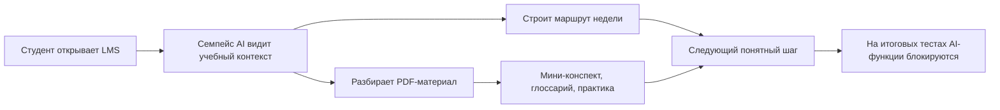

# Семпейс AI

> AI-тьютор для LMS, который помогает студенту понять, что учить сейчас, быстро разобрать учебные материалы и не использовать AI там, где должен работать итоговый контроль знаний.

[](#установка-установочного-файла)
[](#техническая-схема)
[](#техническая-схема)
[](#безопасность)

## Продукт в одном экране

| Для кого | Что делает | Главная ценность |
| --- | --- | --- |
| Студенты LMS | Строит учебный маршрут, объясняет PDF, помогает закреплять материал | Меньше хаоса, больше понятных следующих шагов |
| Университеты и EdTech | Добавляет AI-помощника поверх существующей LMS | Повышает вовлеченность без перестройки платформы |
| Кураторы и методисты | Видят, что студент получает безопасную учебную поддержку | AI помогает учиться, а не обходить контроль |



## Основной функционал

| Блок | Возможность | Как выглядит для пользователя |
| --- | --- | --- |
| **Маршрут недели** | Персональный план занятий на ближайшие дни | Студент видит, какие материалы открыть и сколько времени заложить |
| **AI-тьютор по PDF** | Разбор загруженной лекции или учебного материала | Можно задать вопрос по теме и получить объяснение простым языком |
| **Мини-конспект** | Короткая выжимка из материала | Главные тезисы без перегруза |
| **Глоссарий** | Термины и определения | Быстрое погружение в тему |
| **Практическая работа** | Задания для закрепления | Студент проверяет понимание, а не просто читает ответ |
| **AI Feedback** | Обратная связь по учебному ответу | Подсказка, что улучшить и какой следующий шаг сделать |
| **Безопасность на тестах** | Автоматическое отключение AI-функций | На страницах итогового контроля AI не помогает сдавать тест |

## Как это работает

```text
LMS page
  |
  | 1. Расширение считывает только учебный контекст страницы
  v
Browser extension
  |
  | 2. Отправляет обезличенный контекст и учебный запрос
  v
Backend API
  |
  | 3. Формирует маршрут, объяснение, конспект или feedback
  v
Student UI
  |
  | 4. Студент получает понятный следующий шаг
```

## Безопасность

Семпейс AI спроектирован как учебный помощник, а не инструмент обхода контроля.

| Принцип | Что это значит |
| --- | --- |
| Read-only подход | Расширение не кликает по LMS, не отправляет формы и не меняет DOM LMS |
| Ограничение на тестах | AI-функции блокируются на страницах итоговых и компетентностных тестов |
| Минимизация данных | В работу берется только учебный контекст, нужный для помощи студенту |
| PDF без хранения | Текст PDF обрабатывается для ответа и не сохраняется как учебный архив |
| Контроль доступа | Backend использует лимиты, токены и server-side проверки |

## Установка установочного файла

Ниже инструкция для ручной установки в Chrome, Chromium или Яндекс Браузер. Пользователю нужен только установочный файл, скачанный с лендинга.

### 1. Скачайте установочный файл

Откройте лендинг проекта и нажмите кнопку скачивания установочного файла.

После скачивания в папке загрузок появится ZIP-архив. Не запускайте его двойным кликом как обычную программу: браузеру нужна распакованная папка расширения.

### 2. Распакуйте установочный файл

1. Нажмите правой кнопкой мыши по скачанному ZIP-архиву.
2. Выберите **Извлечь все** или аналогичную команду архиватора.
3. Откройте распакованную папку.
4. Найдите внутри папку **extension**.

Именно папку **extension** нужно будет выбрать в браузере.

### 3. Откройте страницу расширений

Для Chrome или Chromium:

```text
chrome://extensions/
```

Для Яндекс Браузера:

```text
browser://extensions/
```

Если адрес `browser://extensions/` не открылся, используйте:

```text
chrome://extensions/
```

### 4. Включите режим разработчика

На странице расширений включите переключатель **Режим разработчика**.

Обычно он находится в правом верхнем углу страницы. После включения появятся дополнительные кнопки управления расширениями.

### 5. Загрузите распакованное расширение

1. Нажмите **Загрузить распакованное расширение**.
2. В открывшемся окне выберите папку **extension** из распакованного установочного файла.
3. Подтвердите выбор папки.

Важно: выбирать нужно именно папку **extension**, а не сам ZIP-архив и не родительскую папку.

### 6. Проверьте, что расширение установлено

После выбора папки в списке расширений должен появиться **Семпейс AI**.

Проверьте:

- переключатель расширения включен;
- ошибок на карточке расширения нет;
- иконка расширения отображается в браузере или доступна через меню расширений.

### 7. Откройте LMS

1. Перейдите в Synergy LMS или поддерживаемую учебную страницу.
2. Откройте страницу с учебным материалом.
3. Нажмите на иконку Семпейс AI.
4. Проверьте маршрут недели, AI-тьютора по материалу и доступные учебные действия.

На страницах итогового контроля AI-функции должны автоматически отключаться.

## Если что-то не работает

| Проблема | Что проверить |
| --- | --- |
| Расширение не появилось | Выбрана ли именно папка **extension** |
| Браузер не дает загрузить папку | Включен ли **Режим разработчика** |
| Расширение установилось, но не видит LMS | Открыта ли поддерживаемая учебная страница |
| AI-функции заблокированы | Не открыта ли страница итогового теста |
| После обновления ничего не изменилось | Удалите старую версию расширения и загрузите папку **extension** заново |

## Техническая схема

```text
apps/
  backend/      Fastify API, LLM facade, PDF processing, safety checks
  extension/    Chrome MV3 extension, popup UI, LMS content scripts
  landing/      Static landing page and downloadable installation archive

packages/
  shared/       Shared types and validation schemas
```

## Команды разработки

```bash
pnpm install
pnpm dev:backend
pnpm dev:extension
pnpm build:extension
pnpm build:landing
pnpm typecheck
```

## Что проверять перед публикацией

- Собирается backend.
- Собирается расширение.
- Собирается лендинг.
- Установочный файл скачивается с лендинга.
- После распаковки установочного файла папка **extension** загружается в браузер.
- На учебной странице доступны маршрут недели и AI-тьютор.
- На странице итогового теста AI-функции заблокированы.
